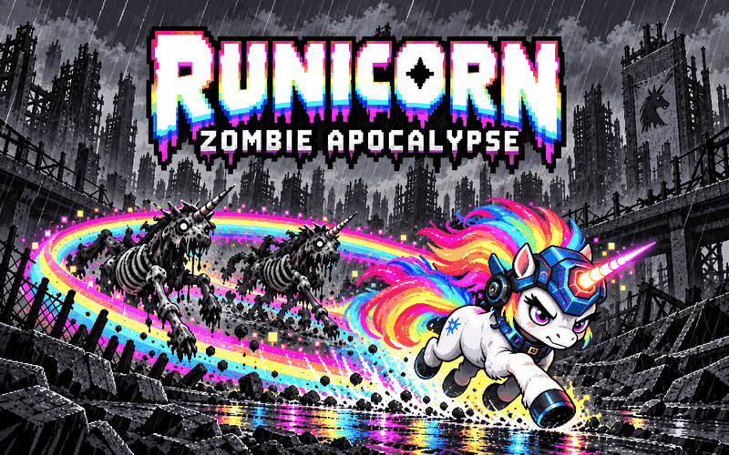

# RUNICORN ZOMBIE APOCALYPSE

The city is dead. Your groove isn't.

A tiny browser arcade game for **js13kGames 2026: Unicorns and Rainbows**. Runicorn is the last living color in a grayscale blackout city. Close rainbow loops around zombie unicorns, dash through corrupted trails, and tune your build between five districts. Jacob wished unicorns into existence. Esau wished for a zombie apocalypse. Isaac, the genie's former keeper, guides the last magical unicorn to rescue Jacob and undo the second wish.



Upload-ready artwork: [320 × 320 listing](promo/listing-320.png) and [800 × 500 header](promo/header-800.png). See [artwork formats and export details](promo/PROMOS.md).

## Play

Open `dist/index.html` directly after building, or use the local server:

```sh
npm ci
npm run build
npm run dev
```

Visit http://127.0.0.1:4173/dist/index.html for the competition build, or the root URL for development. Click the title artwork or press a key to unlock menu music. Browser audio requires an interaction.

| Action | Desktop | Touch |
| --- | --- | --- |
| Steer | WASD or arrows | Left joystick |
| Rainbow Dash | Space | DASH button |
| Purify | Cross an older part of your rainbow to close a loop | Same |
| Blaster | Forward auto-fire; steer to aim | Same |
| Choose mutation | Arrows then Enter/Space; click or 1 / 2 / 3 | Tap row |
| Continue dialogue | Enter, Space, or Continue | Continue / Skip |
| Pause | P, Escape, or pause button | Pause button |

Keep moving. Your own trail is safe; enemy trails are jagged and gray. Dashing protects you from damage, but walls still block your movement. Survive 45 seconds, then touch the relay at the center. In the final district, defeat the Warden first. Loops deal extra damage to it.

## Systems

- Constant motion with smooth steering and swept movement collision.
- Trail intersections form polygons. Zombies inside are purified; used trail sections are consumed.
- Three enemy roles: pursuer, predictive flanker, and telegraphed charger. The Warden combines charging and area denial.
- Seeded city lots separated by connected streets, with the central relay reserved.
- Weighted mutation offers with prerequisites and caps. Later offers can combine a primary effect with a compatible secondary mutation.
- Four-frame pixel animation exported through LibreSprite. Grayscale enemies derive from the same small atlas, with armor on chargers. Muzzle sparks, dash afterimages, and loop flashes provide combat feedback.
- Original 148 BPM electro-rock track with filtered bass, power chords, drums and arpeggios. Loop closures trigger an immediate bass impact, followed by one of three beat-synced arpeggio phrases with echoes. Larger catches add notes. Pickups and dashes share the musical clock; the blaster has a descending arcade zap. The title has a lead arrangement and narration has soft chords and a bell-like melody. All audio is synthesized with Web Audio.
- Original embedded 5x7 pixel font, 14 item icons, colored equipment HUD, black dialog panels with double pixel borders and letter-synchronized voice blips. Pixel story scenes shift from color to a ruined gray city and back.
- Standard competition build: no runtime downloads, external fonts, analytics, or network services. Best scores use only `runicorn2026:best`.

The interface follows NES weapon-screen conventions with Runicorn's charcoal/cyan palette: a centered rainbow logo, framed item sockets, a single blinking cursor, and text commands. See [the reference study and menu controls](docs/NES-MENUS.md).

See [the algorithm notes](docs/ALGORITHMS.md) for the implementation and limitations.

## Build and checks

```sh
npm test
npm run build
npm run dev
# In another terminal:
npx playwright install chromium firefox
npm run test:browser
```

The build bundles JavaScript with esbuild, shortens DOM and mutation identifiers, minifies with Terser, packs the HTML/CSS/game with Roadroller, then creates a standard DEFLATE ZIP with Zopfli. Mutation identifiers are reserved consistently through minification. The original font is embedded inside the packed payload. Packing parameters are checked in for repeatability. `npm run build -- --retune` searches for new parameters and intentionally updates them.

`dist/runicorn.zip` contains only `index.html`. The build verifies extraction and fails above 13,312 bytes. `dist/size.json` records the exact bytes and SHA-256. Promotional images and readable source are outside the competition archive.

GitHub Actions always builds and tests `main`. Its optional Pages deployment runs only when repository variable `ENABLE_PAGES` is `true`; enable GitHub Pages with GitHub Actions as its source before setting that variable. Wavedash and js13k publishing use their separate release workflows.

## Edit the art

LibreSprite 1.1 was used for the sprite export. Install its official release, then set `LIBRESPRITE` to the executable path if it is not at `vendor/libresprite/libresprite.exe`.

```sh
npm run art
```

This regenerates `art/runicorn.aseprite` from the original pixel matrices, runs LibreSprite's batch export, and packs the exported PNG into `src/art.js`. To keep edits made directly in LibreSprite, export the four frames to `art/runicorn.png` and run `node scripts/pack-art.mjs` instead of regenerating the source.

The font is generated from original scanlines with FontTools. Repeated row shapes become shared TrueType components; fractional placement avoids gaps at small font sizes. Its source is `scripts/font.py`. To regenerate it:

```sh
python -m pip install -r scripts/requirements-art.txt
npm run font
```

The checked-in font needs no Python tooling for normal builds. `src/icons.js` contains the original 8x8 item silhouettes used by pickups, weapon rows, and the HUD. `promo/electro-preview.webm` is an audio capture from gameplay.

## Licensing

Game code, pixel matrices, the pixel font, dialogue and synthesized music are MIT-licensed. Cover illustrations are promotional artwork, not gameplay screenshots. No franchise artwork or recordings are imported.

Build-tool notices are in [THIRD-PARTY.md](THIRD-PARTY.md). LibreSprite is an external GPL-licensed authoring tool, excluded from this repository and the game archive.

## Loop Encore / v1.5.0

- Megacorn fires forward every 0.85 seconds before haste upgrades, with 1.1-second projectile life. Steering now matters.
- The Requiem Gun fires a three-shot spread on dash, with its own four-second cooldown.
- Rare Nyan-Unicorn adds 10% movement speed, a pastry body, beat-timed flight bob, a denser six-band rainbow and a busier chiptune lead.
- Green Herb heals one heart on a loop hit, up to three hearts, once every 12 seconds.
- The Warden has 24 HP, reduced passive-trail and projectile damage, and faster movement and charges below half health.
- Lethal damage freezes the encounter for 1.8 seconds, marks the cause and turns Runi undead before showing the results.
- Touch layouts fill the viewport. Simplified scenery and CSS frames make room for the audio and gameplay within the cap.

The standard archive is **13,290 bytes / 13,312**, SHA-256 `aa21031e95971416778d3dac644788192f1fe3c29fdd68b296ea836764f99c5f`.

The original game is shipped on js13kGames and Wavedash (confirmed by Christian, September 10). This update uses the js13k `.website/game.zip` pull-request workflow and a separate Wavedash upload. See [the release record](SUBMISSION.md) for update status and verification. The Wavedash SDK wrapper is 15,904 bytes and remains separate from the competition archive.

Listen to the [menu, narration and loop-reward sample](promo/loop-encore.webm). Run `npm run test:encore` for the new behavior checks and `npm run record:encore` to record a fresh sample.
